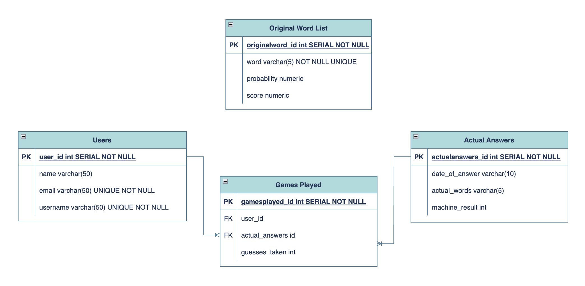

# Wordle Helper Back-End Group Project

We are The Imitation Game, a team consisting of [BNTA](https://techacademy.brightnetwork.co.uk/) Cohort 4 members, [Alex](https://github.com/oleksiysmola), [Cristian](https://github.com/Roscaaa), [Suad](https://github.com/suadali), [Rosalinda](https://github.com/rosaacodes), and [Rachel](https://github.com/rkaurb).

<!--  -->


## Contents

* [Introduction – project outline and Tech Stack](#introduction)
* [Step-by-step instructions for initial set-up](#step-by-step-instructions-for-initial-set-up)
* [Project Structure](#project-structure)
* [Methods](#methods)
   * [Word Service](#_word-service_-wordservice)
   * [Answer Service](#_answerservice_-answerservice)
* [Using the API – HTTP Requests](#using-the-api--http-requests)
   * [Helper mode](#_primary-helper-mode-requests_)
   * [Competitive mode](#_primary-competitive-mode-requests_)


## Introduction

This collaborative project was completed as part of the [Bright Network Technology Academy programme](https://techacademy.brightnetwork.co.uk/). The project consists of a Wordle helper application, based on the concepts of information theory utilised in a YouTube video by 3Blue1Brown – [_Solving Wordle using Information Theory_](https://www.youtube.com/watch?v=v68zYyaEmEA).
<br><br>
The API was created using [Java](https://jdk.java.net/17/), [SpringBoot](https://spring.io/projects/spring-boot), and [PostgresQL](https://www.postgresql.org/), and tested using [Postman](https://www.postman.com/). The list of all possible words was taken from [here](https://gist.github.com/Brystephor/c7fde59e673534dcb4d687243195b544), while the answers for each day's Wordle were found by inspecting the [Wordle](https://www.nytimes.com/games/wordle/index.html) website.
<br><br>
There are two modes:
* The purpose of _Helper mode_ is to help the user guess the five-letter word of the day in just a few tries!
* There is also a _Competitive mode_, including features that allow the user to create a user profile in the database, track their score against other users as well as against the machine, and to retrieve the average number of guesses it takes them to get the correct word.

Our project requirements and development schedule can be found [here](plan.md).


## Step-by-step instructions for initial set up

1. Make sure that you have installed Java and PostgresQL.
   <br><br>
2. Clone this repository:
   ``git clone git@github.com:https://github.com/Roscaaa/Wordle-Helper.git`` and open in your favourite Java IDE (we recommend [IntelliJ](https://www.jetbrains.com/idea/download/#section=mac))
   <br><br>
2. Create a new PostgresQL database called ``wordle``. (If using the terminal, type ``psql`` to launch PostgresQL, and then run ``CREATE DATABASE wordle;``)
   <br><br>
3. Use the ``worlde.sql`` script to populate your ``wordle`` database tables. To do this, you can either:
    * copy and paste each command individually, in sequence, using the terminal; _or_
    * execute the entire sql script using Postico or similar database client
      <br>

&nbsp;&nbsp;&nbsp;&nbsp;_**Note** — the DROP TABLES commands at the beginning of the sql script are not necessary if setting up database for the first time (see below):_
```sql
DROP TABLE IF EXISTS original_word_list CASCADE;
DROP TABLE IF EXISTS users CASCADE;
DROP TABLE IF EXISTS actual_answers CASCADE;
DROP TABLE IF EXISTS all_games CASCADE;
```

&nbsp;&nbsp;&nbsp;&nbsp;_**Also Note** — For the below commands, make sure to replace with the correct file paths:_

```sql
-- Insert data into original word list table
COPY original_word_list (word, probability, score) FROM
'/[insert file path here]/initialcalculations.txt' DELIMITER ',' CSV;
```
```sql
-- Insert actual answers and respective dates data into actual answers table
COPY actual_answers (date_of_given_answer, actual_word) FROM
'/[insert file path here]/date-word-answer.txt' DELIMITER ',' CSV;
```

5. Open Postman, and run the following HTTP request to populate the machine scores in the actual_answers table: ``localhost:8080/competitive/computemachinescores``. Note that this stage may take some time, as it computes the machine scores for all of the ~3,000 actual answers!


## Project Structure

### Entity Relationship (ER) Diagram



## Methods
See below for a list of methods used in each class and their descriptions:
### _Word Service_ (``WordService``)
This service class invokes the data access layer to retrieve ``Word`` objects from the database. In addition, it also contains methods pertaining to the logic of the Wordle solver itself.
##### &nbsp;&nbsp;&nbsp;&nbsp;``.GetAllWords()``
Return a list of all entries in the original_word_list table
as ``Word`` objects.
##### &nbsp;&nbsp;&nbsp;&nbsp;``.GetAllWordsRankedByScore()``
Same as ``.GetAllWords`` except the list of ``Word`` objects is ranked
by the score property.
##### &nbsp;&nbsp;&nbsp;&nbsp;``.GetAllWordsRankedByScore(Integer numOfWords)``
Same as ``.GetAllWordsRankedByScore`` except the list of ``Word`` objects has a
size given by ``numOfWords``.
##### &nbsp;&nbsp;&nbsp;&nbsp;``.GetWordById(Integer id)``
Retrieves ``Word`` with given ``id`` from the
original_word_list table.
##### &nbsp;&nbsp;&nbsp;&nbsp;``.GetWordByName(String nameOfWord)``
Retrieves first ``Word`` whose ``word`` property equals ``nameOfWord`` from the
original_word_list table.
##### &nbsp;&nbsp;&nbsp;&nbsp;``.WordValidator(String word)``
Returns ``true`` if given string is included in the word column
in the original_word_list table, otherwise an exception is thrown.
##### &nbsp;&nbsp;&nbsp;&nbsp;``.setUniformProbabilities(List<Word> wordList)``
Returns input list of ``Word`` objects after
setting the probability property of each ``Word`` to
all be equal and sum to unity. As an example a list consisting
of two ``Word`` objects will be returned with probabilities
both set to ``0.5``.
##### &nbsp;&nbsp;&nbsp;&nbsp;``.GenerateWordPattern(Word word, Word targetWord)``
Returns a ``LinkedHashMap<String, String>`` representing the
pattern obtained by guessing ``word`` assuming ``targetWord``
is the answer.

As an example, the Wordle pattern depicted here
would be represented by the map:
```json
{
  "f0": "yellow",
  "o1": "yellow",
  "o2": "green",
  "d3": "grey",
  "s4": "green"
}
```
In general, keys are denoted with the letter followed by the
index marking its position in the word. The values take three
values ``"yellow"``, ``"green"`` and ``"grey"`` each representing
the colour of the letter in the Wordle pattern.
##### &nbsp;&nbsp;&nbsp;&nbsp;``.CheckPatternMatch(Word word, Word targetWord, LinkedHashMap<String, String> pattern)``
&nbsp;&nbsp;&nbsp;&nbsp;Returns ``true`` if ``word`` and ``targetWord`` can reproduce
``pattern`` when passed as arguments of the ``.GenerateWordPattern``
method. Otherwise, ``false`` is returned.
##### &nbsp;&nbsp;&nbsp;&nbsp;``findMatchingWords(Word guess, List<Word> wordList, LinkedHashMap<String, String> pattern)``
&nbsp;&nbsp;&nbsp;&nbsp;Returns a list of ``Word`` objects consisting of the words in
``wordList`` that return ``true`` when passed as the ``targetWord``
argument of ``.checkPatternMatch``. Here ``guess`` and ``pattern`` serve
as the other arguments.
##### &nbsp;&nbsp;&nbsp;&nbsp;``.computePatternProbability(Word guess, List<Word> wordList, LinkedHashMap<String, String> pattern)``
For a given ``guess``, compute a ``Double`` whose value represents the
probability that the given ``pattern`` is obtained. This is determined
through the sum of the probabilities of all ``Word`` objects in
``wordList`` that give return ``true`` when entered as the ``targetWord``
argument for ``.checkPatternMatch``.
##### &nbsp;&nbsp;&nbsp;&nbsp;``.logTwo(Double value)``
Returns the ``Double`` whose value is the log base two of the argument.
##### &nbsp;&nbsp;&nbsp;&nbsp;``.computeWordScore(Word word, List<Word> wordList)``
Computes the average of the number of times one expects ``wordList``
to be halved in size by guessing ``word``.
##### &nbsp;&nbsp;&nbsp;&nbsp;``.computeScoreDistribution(List<Word> wordList)``
&nbsp;&nbsp;&nbsp;&nbsp;Applies the ``.computeWordScore`` method to each ``Word`` in ``wordList``
and sets the ``score`` property to the value returned by the method.
The resulting list of ``Word`` objects is then returned.
##### &nbsp;&nbsp;&nbsp;&nbsp;``getGuessesForAnswer(Answer answer)``
Computes number of guesses taken for the Wordle solver to guess
``answer``. The ``answer`` is then returned with the ``machineResult``
property set to the computed value.


### _AnswerService_ (``AnswerService``)
This service class invokes the data access layer to retrieve and update
``Answer`` objects from the database.

##### &nbsp;&nbsp;&nbsp;&nbsp;``.getAllAnswers()``
Return a list of all entries in the actual_answers table
as ``Answer`` objects.

##### &nbsp;&nbsp;&nbsp;&nbsp;``.doesAnswerWithIdExists(Integer id)``
Returns ``true`` if Answer object with the id exists in actual_answers table

##### &nbsp;&nbsp;&nbsp;&nbsp;``.getAnswerById(Integer id)``
Returns Answer object with the corresponding id from actual_answers table

##### &nbsp;&nbsp;&nbsp;&nbsp;``.addAnswerToTable(Answer answer)``
Takes ``Answer`` object and adds to actual_answers table

##### &nbsp;&nbsp;&nbsp;&nbsp;``.deleteAnswerById(Integer id)``
Deletes ``Answer`` object with corresponding id from actual_answers table from argument

##### &nbsp;&nbsp;&nbsp;&nbsp;``.updateAnswerById(Integer id, Answer answer)``
Updates ``Answer`` object with corresponding id from actual_answers table with ``Answer`` object passed in argument


## Using the API – HTTP Requests

### Plain Old Java Objects (POJOs)
In this section, the POJOs used in the project are listed along with their properties and related JSON structure when using POST and PUT request:

HTTP Request  | Type                                                                                               | Function
------------- |----------------------------------------------------------------------------------------------------| -------------
**Word** | • Integer ID <br> • String Word <br> • Double Probability <br> • Double Score                      | N/A
**User**  | • Integer ID <br> • String Name <br> • String Email <br> • String Username                         | {<br>&nbsp;&nbsp;&nbsp;&nbsp;"name": "Suad",<br>&nbsp;&nbsp;&nbsp;&nbsp;"email": "suad@tig.com",<br>&nbsp;&nbsp;&nbsp;&nbsp;"userName": "SusuTheFlowerPot"<br>}
**Answer**  | • Integer ID <br> • LocalDate DateOfAnswer <br> • String AnswerOfDay <br> • Integer MachineResults | {<br>&nbsp;&nbsp;&nbsp;&nbsp;"dateOfAnswer": "2025-01-04",<br>&nbsp;&nbsp;&nbsp;&nbsp;"answerOfDay": "waist",<br>&nbsp;&nbsp;&nbsp;&nbsp;"machineResult": 3<br>}
**Game** | • Integer ID <br> • Integer UserId <br> • Integer AnswerId <br> • Integer UserGuesses              | {<br>&nbsp;&nbsp;&nbsp;&nbsp;"userId": 1,<br>&nbsp;&nbsp;&nbsp;&nbsp;"answerId": 1,<br>&nbsp;&nbsp;&nbsp;&nbsp;"userGuessed": 3<br>}

<br>
The API can be used with the following HTTP requests, in the Postman desktop application:

### _Primary Helper Mode Requests_

HTTP Request  | Type   | Function
------------- |--------| -------------
localhost:8080/helper | GET    | Get all words.
localhost:8080/helper/ranked | GET    | Get all words ranked by score.
localhost:8080/helper/ranked/{numOfWords} | GET    | Get all words ranked by score and specify how many words returned.
localhost:8080/helper/start | GET    | Start the game. Will return best guesses ordered by score.
localhost:8080/helper/start/{word} | DELETE | Input your guess for {word} and include the pattern that you got from Wordle in request body as JSON (i.e. which letters were green, yellow, grey). Example: <br> { <br> &nbsp;&nbsp;&nbsp;&nbsp;"f0": &nbsp;&nbsp;&nbsp;&nbsp;"yellow", <br> &nbsp;&nbsp;&nbsp;&nbsp;"o1": "yellow", <br> &nbsp;&nbsp;&nbsp;&nbsp;"o2": "green", <br> &nbsp;&nbsp;&nbsp;&nbsp;"d3": "grey", <br> &nbsp;&nbsp;&nbsp;&nbsp;"s4": "green" <br>}
localhost:8080/helper/endgame | DELETE | Ends game when you got the correct word.

### _Secondary Helper Mode Requests_

HTTP Request  | Type | Function
------------- |------| -------------
localhost:8080/helper/wordbyid/{id} | GET  | Get word by word id.
localhost:8080/helper/wordbyname/{nameofword} | GET  | Get word by word name.

### _Primary Competitive Mode Requests_

HTTP Request  | Type   | Function
------------- |--------| -------------
localhost:8080/competitive/computemachinescores | PUT    | Required to run as part of Competitive Mode setup. This will populate machine guesses in actual_answers table.
localhost:8080/competitive/all | GET    | Get all games in database.
localhost:8080/competitive/addgame | POST   | Add new game (JSON) to database using Request Body. Example: <br> {<br>&nbsp;&nbsp;&nbsp;&nbsp;"userId": 1,<br>&nbsp;&nbsp;&nbsp;&nbsp;"answerId": 1,<br>&nbsp;&nbsp;&nbsp;&nbsp;"userGuessed": 3<br>}
localhost:8080/competitive/dailyresults/{date}| GET    | Get all result on given date.
localhost:8080/competitive/userresults/{username}/{date}| GET    | Get all result on for username given date.
localhost:8080/competitive/userresults/{username}| GET    | Get all result on for username.
localhost:8080/competitive/averageresults/{username}| GET    | Get the average of a user's guesses.
localhost:8080/competitive/start/{userId}| GET    | Start a game for a user with matching id.
localhost:8080/competitive/start/{userid}/{guess}| DELETE | Input the user's guessed in {guess}. Repeat for each guess until game is complete.
localhost:8080/competitive/start/{userid}/end| POST   | End game for user and save result to database.
localhost:8080/user| GET    | Get all users from database.
localhost:8080/user/{userId}| GET    | Get user from database by id.
localhost:8080/user| POST   | Add user (JSON)  to database using Request Body. Example: <br> { <br> &nbsp;&nbsp;&nbsp;&nbsp;"name": "Suad", <br> &nbsp;&nbsp;&nbsp;&nbsp;"email": "suad@tig.com", <br> &nbsp;&nbsp;&nbsp;&nbsp;"userName": "SusuTheFlowerPot" <br>}

### _Secondary Competitive Mode Requests_

HTTP Request  | Type   | Function
------------- |--------| -------------
localhost:8080/competitive/{id} | PUT    | Update game (JSON) by id through Request Body. Example: <br> {<br>&nbsp;&nbsp;&nbsp;&nbsp;"userId": 1,<br>&nbsp;&nbsp;&nbsp;&nbsp;"answerId": 1,<br>&nbsp;&nbsp;&nbsp;&nbsp;"userGuessed": 3<br>}
localhost:8080/competitive/{id} | DELETE | Delete game by id.
localhost:8080/competitive/{id} | GET    | Get game by id.
localhost:8080/answers | GET    | Get all answers.
localhost:8080/answers/{id} | GET    | Get an answer by answer id.
localhost:8080/answers/addanswer | POST   | Add answer (JSON) using Request Body. Example: <br> {<br>&nbsp;&nbsp;&nbsp;&nbsp;"dateOfAnswer": "2025-01-04",<br>&nbsp;&nbsp;&nbsp;&nbsp;"answerOfDay": "waist",<br>&nbsp;&nbsp;&nbsp;&nbsp;"machineResult": 3<br>}
localhost:8080/answers/{id} | DELETE | Delete answer by id.
localhost:8080/answers/update/{id} | PUT    | Update answer (JSON) by id using Request Body. Example: <br> {<br>&nbsp;&nbsp;&nbsp;&nbsp;"dateOfAnswer": "2025-01-04",<br>&nbsp;&nbsp;&nbsp;&nbsp;"answerOfDay": "waist",<br>&nbsp;&nbsp;&nbsp;&nbsp;"machineResult": 3<br>}
localhost:8080/user/{userId} | DELETE | Delete user by id.
localhost:8080/user/{userId} | PUT    | Update user (JSON) by id using Request Body. Example: <br> { <br> &nbsp;&nbsp;&nbsp;&nbsp;"name": "Suad", <br> &nbsp;&nbsp;&nbsp;&nbsp;"email": "suad@tig.com", <br> &nbsp;&nbsp;&nbsp;&nbsp;"userName": "SusuTheFlowerPot" <br>}


## Acknowledgements

A huge thanks to the [BNTA](https://techacademy.brightnetwork.co.uk/) team, and especially to our trainers, [Colin](), [Nelson](), and [Iain]()!


